# Oauth2.0

首先我们得了解什么是Oauth2.0，简单来说Oauth2.0它是一个授权协议。我们可能会听说过，使用Oauth2.0来实现单点登录，以及第三方登录。那个什么是授权？

举个通俗易懂的例子，就是第三方人员A要想进入B公司的大厦进行业务交流的时候，因为A并不是B公司的员工，出于安全的缘故，所以他不能够自由的出入B公司的大厦。那个A到了B公司前台的时候，A得去前台和B公司前台工作人员说明来意，并且出示邀请（访问）证明，此时B公司前台工作人员就会给你一张临时工牌让你进入大厦。

在这个例子当中，A没有工牌所以是无法进入B公司大厦里进行业务交流，B公司前台给A一张临时工牌，这个操作就相当于授权。

总的来说，OAuth 2.0 这种授权协议，就是保证第三方（软件）只有在获得授权之后，才可以进一步访问授权者的数据。


## 1、Oauth2.0授权许可机制协议

Oauth2.0具有多种授权许可机制协议：授权码许可机制、客户端凭据机制、资源拥有者凭据机制（密码模式）和隐式许可机制。

在了解授权许可机制协议之前，我们得需要了解在OAuth 2.0 的体系里面有 4 种角色，按照官方的称呼它们分别是资源拥有者、客户端、授权服务和受保护资源。

- 资源拥有者（可以指拥有资源的用户）
- 客户端（可以理解为第三方系统/软件）
- 授权服务（权限校验和授权系统(认证服务中心)）
- 受保护资源（用户在系统上所具有的资源/或者能够访问的资源）

### 1.1、授权码许可机制

授权码许可机制的参与者：资源拥有者、客户端、授权服务、受保护资源

授权码模式这种场景下的授权，第三方软件可以通过拿到资源拥有者授权后的授权码，以及注册时的 client_id 和 client_secret 来换回访问令牌 token 的值。

时序图：

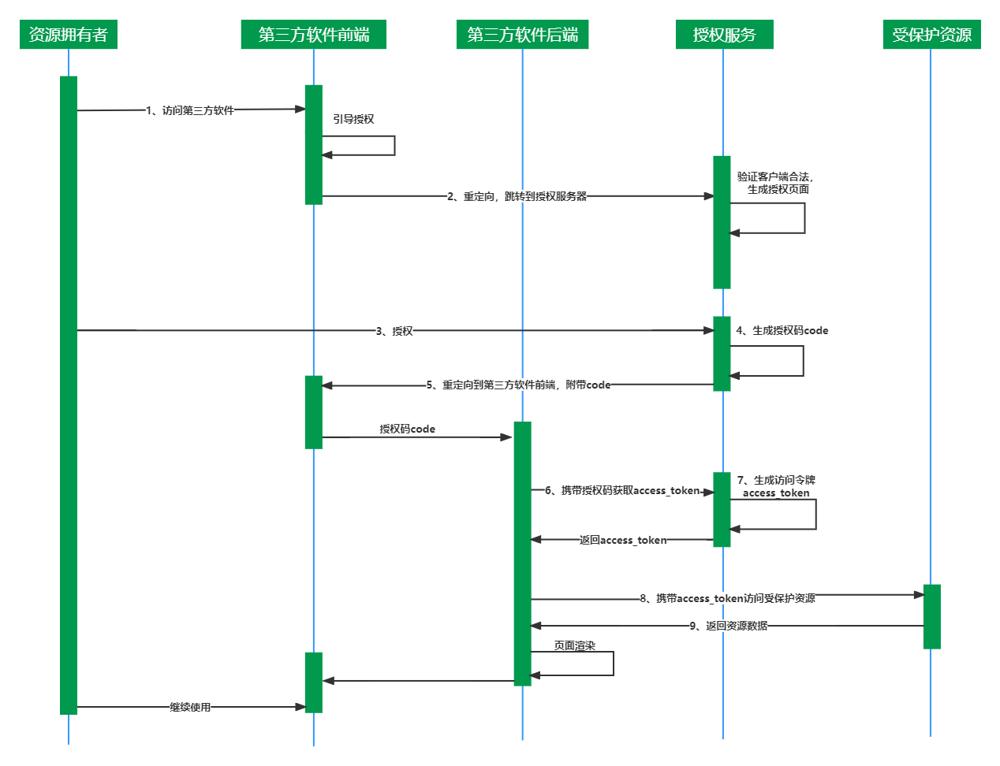

按照上述时序图举个简单的例子，小明使用微信授权方式登录app。

0. 小明点开手机里面的app，他不想手动输入账号密码登录，而是采用了微信登录。
1. 点击微信登录按钮，app拉起授权页面。
2. 微信授权服务器则生成授权页面，用户看见授权页面点击确定按钮进行授权。
3. 微信授权服务器校验用户身份合法性后生成请求code，点击确认授权后，页面跳转至app页面并携带请求code(授权码)。
4. app拿到授权码后，携带授权码向授权服务器获取访问令牌access_token。
5. 拿到access_token后，则携带access_token向受保护资源发起访问。
6. 校验access_token无误后，受保护资源返回资源数据（个人的身份数据，昵称，地区等信息）。
7. 成功登录app，小明继续使用app内的功能。


#### 1.1.1、为什么需要生成授权码以及根据授权码获取access_token步骤？

假设从时序图中抹除授权码的流程，那么从第三步，用户点击确定授权，此时资源拥有者与授权服务器就建立起关联，此时，资源拥有者则与第三方软件前端断开关联，界面则会停留在授权界面。然后授权服务器直接把access_token送给第三方软件后端，后端在携带access_token去访问受保护资源。虽然说资源数据已经拿到了，但是如何通知用户呢？因此，得需要建立起用户与第三方软件前端的关联，所以授权服务器生成授权码后重定向到第三方软件前端则是重新建立起用户与第三方软件前端的关联。


既然如此，那么为什么授权服务器不直接重定向传回access_token,首先并不能保证重定向采用的形式是否是https，而且并不是所有的客户端都支持https，所以重定向传回access_token就会增加access_token失窃的风险。虽然access_token需要与client_id,client_secret一起才能够通过授权服务器校验访问到保护资源，但是在安全层面来说，这都是不适合的。在此层面上看，授权码的作用在于access_token不经过用户浏览器, 保护了access_token。

#### 1.1.2、授权码code可以暴露？

1、授权码Authentication code只能用一次，而且会很快超时失效, 使得被截获后难以运用。

2、授权码需要和client id/client secret共同完成认证，才能够获得access_token。就算授权码如果失窃，单凭授权码是无法得到access_token的。

#### 1.1.3、access_token不能暴露在浏览器那么该存放在哪？

重定向传回access_token会使安全保密性要求极高的访问令牌暴露在浏览器，增加访问令牌失窃风险。

刚开始接触Oauth2.0的我也是比较迷，既然access_token不能暴露在浏览器，那么我到底将access_token存放在哪呢？那我前端有如何进行访问那些受保护资源呢？

在我看来，重定向携带的参数在URL上，http协议下重定向传回access_token的形式，是没有经过数据加密的，他会增加令牌失窃的风险。那么关于access_token存放在哪的问题，个人认为通过授权码以及客户端id和secret共同校验后获取的access_token，可以把access_token存放在localStorage中，localStorage虽然是永久存储，但是access_token会有一个有效期，有效期到了之后，即便access_token一直都存在但是有效期过后就无法访问到受保护资源。

#### 1.1.4、sessionStorage和localStorage区别

1、sessionStorage（会话存储）

- 生命周期：浏览器打开到关闭的过程

- 大小：5M

- 保存的位置：浏览器端

```
// 存储数据
sessionStorage.setItem("name", "nameValue");
// 获取数据
sessionStorage.getItem("name");
// 删除数据
sessionStorage.removeItem("name");
// 删除所有数据
sessionStorage.clear();
```


2、localStorage（本地存储【永久存储】）

- 生命周期: 永久，只能人为删除

- 大小: 5M甚至更大

- 保存的位置: 浏览器端

```
// 存储数据
localStorage.setItem("name", "nameValue");
// 获取数据
localStorage.getItem("name");
// 删除数据
localStorage.removeItem("name");
```


**注意: **不同浏览器无法共享localStorage或sessionStorage中的信息。相同浏览器的不同页面间【相同域名和端口】可以共享相同的 localStorage，但是不同页面或标签页间无法共享sessionStorage的信息。


### 1.2、资源拥有者凭据机制（密码模式）

客户端凭据机制的参与者：资源拥有者、客户端、授权服务、受保护资源

资源拥有者凭据，顾名思义就是资源拥有者的凭据（账号，密码）。在这场景里面就不存在第三方软件这概念，相当于就是访问系统中的一个子系统，他们之间互相信任。举个例子来说就是，腾讯有许多的游戏，你只需要用qq账号密码就可以登录游戏玩，不需要进行腾讯授权。因为该游戏是腾讯旗下的，他们相互信任的，所以不存在第三方的说法。

时序图：

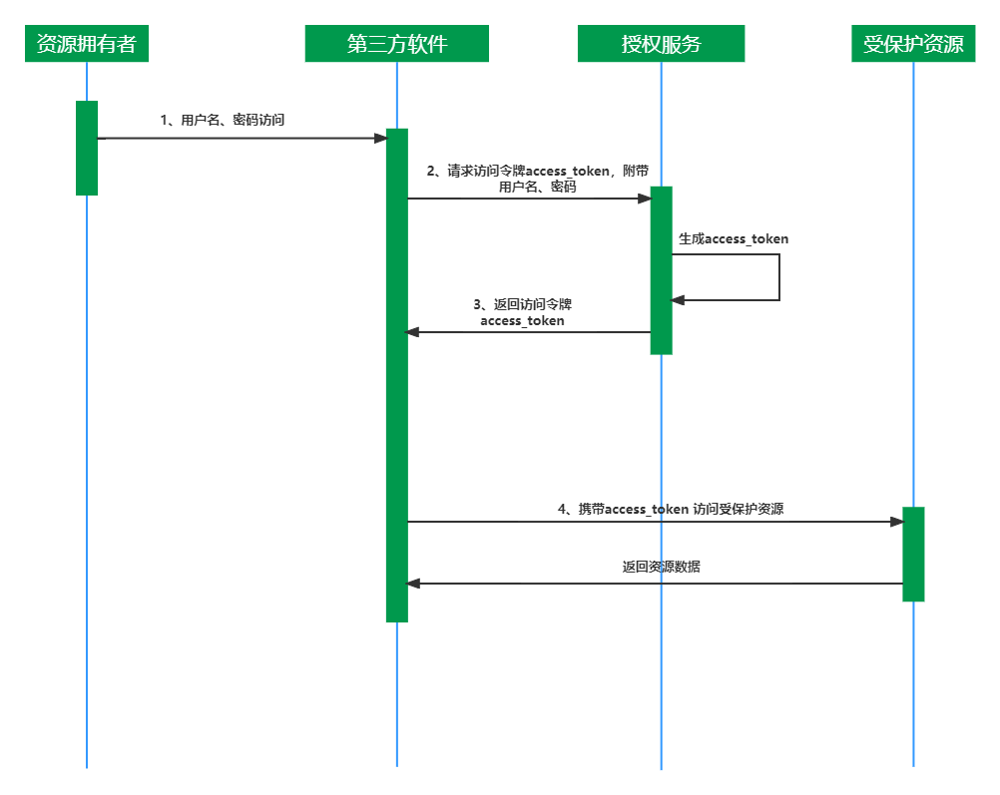


### 1.3、客户端凭据机制

客户端凭据机制的参与者：客户端、授权服务、受保护资源

相当于就是第三方软件访问不需要资源拥有者授权的资源和数据，换句话说在这里客户端也可以看作是资源拥有者。举个例子来说就是第三方软件访问一些公共的服务，譬如说一些地图信息，logo图标等。

这种场景下的授权，便是客户端凭据许可，第三方软件可以直接使用注册时的 client_id 和 client_secret 来换回访问令牌 token 的值。

时序图：

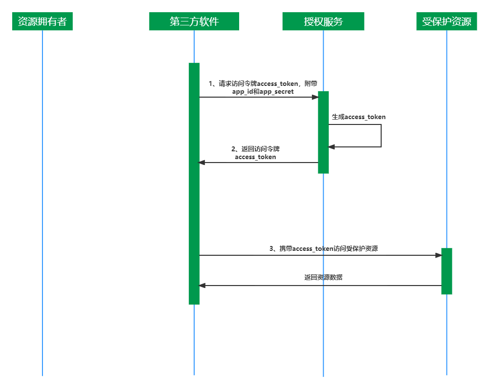


### 1.4、隐式许可机制

隐式许可机制的场景适用于没有后端服务的应用，举个例子来说的话就是在浏览器中执行，譬如说JavaScript应用。

在这种情况下，第三方软件对于浏览器就没有任何保密的数据可以隐藏了，也不再需要应用密钥 app_secret 的值了，也不用再通过授权码 code 来换取访问令牌 access_token 的值了。因此，隐式许可授权流程的安全性会降低很多。

这种场景下的授权，第三方软件可以直接使用注册时的 client_id来换回访问令牌 token 的值。

时序图：

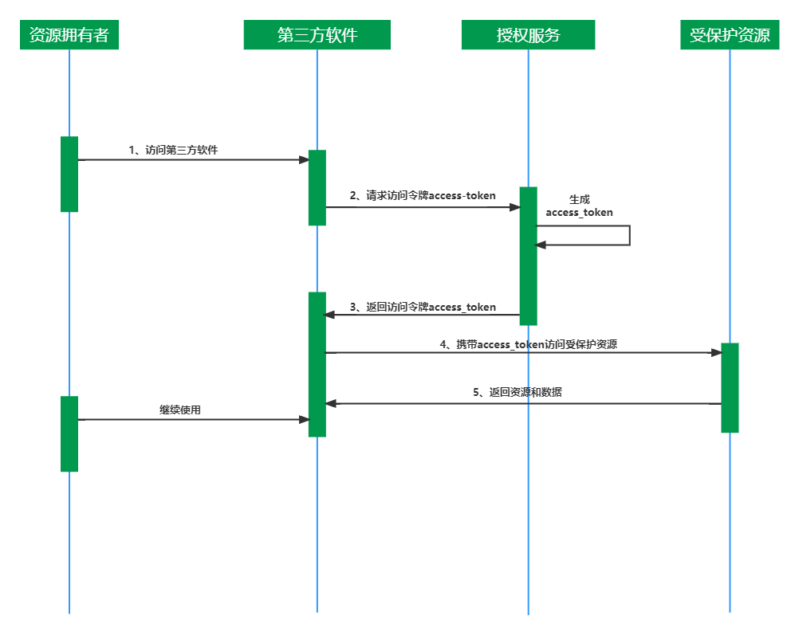


## 2、Oauth2.0实战

### 2.1、搭建授权服务器

#### 2.1.1、 AuthorizationServerConfig（授权服务器配置）

完成以下三个配置：

- ClientDetailsServiceConfigurer：用来配置客户端详情服务（ClientDetailsService）【客户端详情信息在这里进行初始化，你能够把客户端详情信息写死在这里或者是通过数据库来存储调取详情信息。】
- AuthorizationServerEndpointsConfigurer：用来配置令牌（token）的访问端点和令牌服务(tokenservices)
- AuthorizationServerSecurityConfigurer：用来配置令牌端点的安全约束.


配置客户端详情：

```
/**
     * 用来配置客户端详情服务（ClientDetailsService）
     * 允许客户端自己申请ClientID
     *
     * @param clients
     * @throws Exception
     */
    @Override
    public void configure(ClientDetailsServiceConfigurer clients) throws Exception {
        clients.jdbc(dataSource);
    }
    
```

AuthorizationServerSecurityConfigurer：用来配置令牌端点的安全约束.

```
  /**
     * 允许ClientSecret明文方式保存并且可以通过表单提交
     *
     * @param security
     * @throws Exception
     */
    @Override
    public void configure(AuthorizationServerSecurityConfigurer security) throws Exception {
        security.checkTokenAccess("permitAll()").allowFormAuthenticationForClients().passwordEncoder(NoOpPasswordEncoder.getInstance());
    }
```

AuthorizationServerEndpointsConfigurer：用来配置令牌（token）的访问端点和令牌服务(tokenservices)

```
  /**
     * AuthorizationServerEndpointsConfigurer：用来配置令牌（token）的访问端点和令牌服务(tokenservices)
     * @param endpoints
     * @throws Exception
     */
    @Override
    public void configure(AuthorizationServerEndpointsConfigurer endpoints) throws Exception {
        TokenEnhancerChain tokenEnhancerChain = new TokenEnhancerChain();
        //添加自定义 token增强
        tokenEnhancerChain.setTokenEnhancers(Arrays.asList(tokenEnhancer(), jwtTokenEnhancer()));
        endpoints.approvalStore(approvalStore())
                .authorizationCodeServices(authorizationCodeServices())
                .tokenStore(tokenStore())
                .tokenEnhancer(tokenEnhancerChain)
                .authenticationManager(authenticationManager);
    }

    /**
     * 自定义的Token增强器，把更多信息放入Token中
     *
     * @return
     */
    @Bean
    public TokenEnhancer tokenEnhancer() {
        return new EnhanceTokenEnhancer();
    }

    /**
     * 配置JWT令牌使用非对称加密方式来验证
     *
     * @return
     */
    @Bean
    protected JwtAccessTokenConverter jwtTokenEnhancer() {
        //设置jwt的转换器
        JwtAccessTokenConverter converter = new JwtAccessTokenConverter();

        KeyStoreKeyFactory keyStoreKeyFactory = new KeyStoreKeyFactory(
                //设置加密的加载文件
                new ClassPathResource(jksProperties.getName()),
                //设置读取秘钥库文件的密码
                jksProperties.getStorePassword().toCharArray());

        //设置获取秘钥的密码
//        KeyPair keyPair = keyStoreKeyFactory.getKeyPair(jksProperties.getAlias());
        //设置获取秘钥的密码
        KeyPair keyPair = keyStoreKeyFactory.getKeyPair("jwt");
        //设置秘钥对象
        converter.setKeyPair(keyPair);
        return converter;
    }

    /**
     * 使用JDBC数据库方式来保存用户的授权批准记录
     *
     * @return
     */
    @Bean
    public JdbcApprovalStore approvalStore() {
        return new JdbcApprovalStore(dataSource);
    }

    /**
     * 使用JDBC数据库方式来保存授权码
     *
     * @return
     */
    @Bean
    public AuthorizationCodeServices authorizationCodeServices() {
        return new JdbcAuthorizationCodeServices(dataSource);
    }

    /**
     * 使用JWT令牌存储
     *
     * @return
     */
    @Bean
    public TokenStore tokenStore() {
        return new JwtTokenStore(jwtTokenEnhancer());
    }
```


自定义token增强器：EnhanceTokenEnhancer

```
public class EnhanceTokenEnhancer implements TokenEnhancer {
    @Override
    public OAuth2AccessToken enhance(OAuth2AccessToken oAuth2AccessToken, OAuth2Authentication oAuth2Authentication) {
        Authentication userAuthentication = oAuth2Authentication.getUserAuthentication();
        if (userAuthentication != null) {
            Object principal = userAuthentication.getPrincipal();
            //把用户标识以userDetails这个Key加入到JWT的额外信息中去
            Map<String, Object> additionalInfo = new HashMap<>();
            additionalInfo.put("userDetails", principal);
            additionalInfo.put("torlesse", "torlesse");
            ((DefaultOAuth2AccessToken) oAuth2AccessToken).setAdditionalInformation(additionalInfo);
        }
        return oAuth2AccessToken;
    }
}
```


#### 2.1.2、spring security配置

```
@Configuration
public class WebSecurityConfig extends WebSecurityConfigurerAdapter {

    @Autowired
    private TorlesseUserDetailsService torlesseUserDetailsService;

    /**
     * 密码的加密方式
     *
     * @return
     */
    @Bean
    public PasswordEncoder passwordEncoder() {
        return new BCryptPasswordEncoder();
    }

    /**
     * 身份验证管理器
     * 通过自定义实现userDetailsService来实现
     * 配置了使用BCryptPasswordEncoder哈希来保存用户的密码（生产环境的用户密码肯定不能是明文保存）
     *
     * @param auth
     * @throws Exception
     */
    @Override
    protected void configure(AuthenticationManagerBuilder auth) throws Exception {
        // 注入userDetailsService的实现类并通过passwordEncoder进行加密
        auth.userDetailsService(torlesseUserDetailsService).passwordEncoder(passwordEncoder());
    }

    /**
     * 设置认证管理器 便于我们使用 ，使用默认的认证管理器即可
     *
     * @return
     * @throws Exception
     */
    @Override
    @Bean(value = "authenticationManager")
    public AuthenticationManager authenticationManagerBean() throws Exception {
        return super.authenticationManagerBean();
    }

    /**
     * 设置拦截器
     * 除了"/login","/oauth/authorize"请求外,设置为任意的请求都需要登录认证
     *
     * @param http
     */
    @Override
    protected void configure(HttpSecurity http) throws Exception {

        http.authorizeRequests()
                .antMatchers("/login", "/oauth/authorize", "/oauth/token")
                .permitAll()
                .anyRequest().authenticated()
                .and()
                .csrf().disable()
                .formLogin().loginPage("/login");
    }

    /**
     * 静态资源放行【如果存在静态资源的话】
     *
     * @param webSecurity
     */
    @Override
    public void configure(WebSecurity webSecurity) {
        // 静态资源放行
        webSecurity.ignoring().antMatchers("/dist/**", "/moudle/**", "/plugins/**");
    }
}
```

#### 2.1.3、四种许可机制测试

启动授权服务器验证四种授权模式的场景。

##### 1、隐式许可机制

首先在浏览器中发送请求

```
http://localhost:8080/oauth/authorize?response_type=token&client_id=torlesse003&redirect_uri=https://baidu.com
```

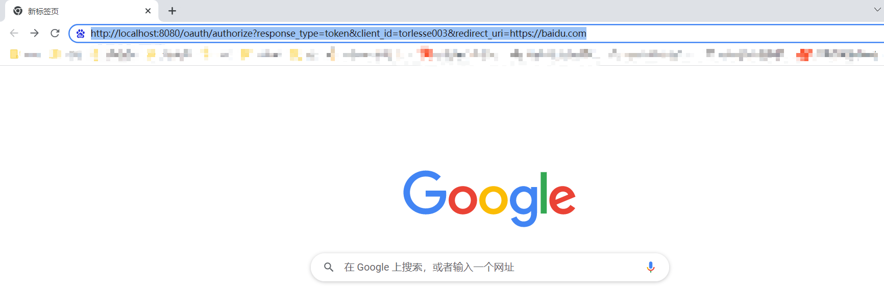

回车后，需要登陆授权

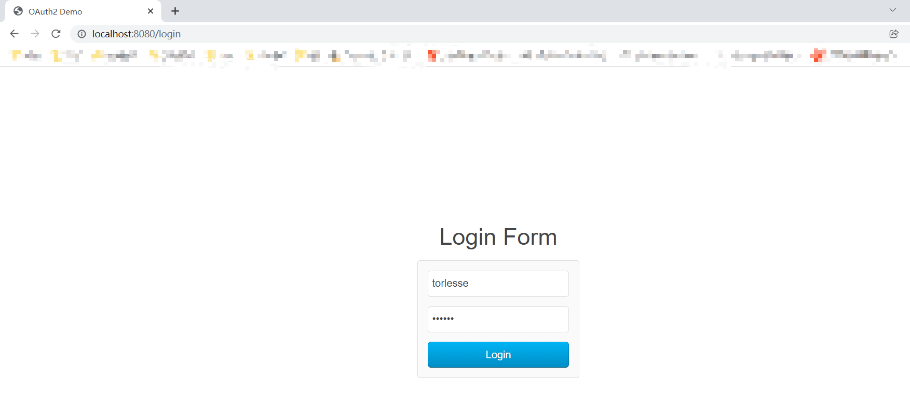

点击登陆后

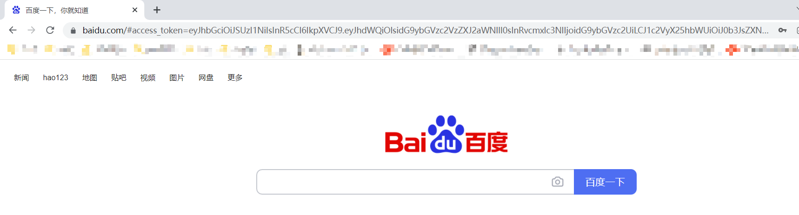

则可以直接获取到access_token

```
https://www.baidu.com/#access_token=eyJhbGciOiJSUzI1NiIsInR5cCI6IkpXVCJ9.eyJhdWQiOlsidG9ybGVzc2VzZXJ2aWNlIl0sInRvcmxlc3NlIjoidG9ybGVzc2UiLCJ1c2VyX25hbWUiOiJ0b3JsZXNzZSIsInNjb3BlIjpbIlRFU1QiXSwiZXhwIjoxNjQ5NzkwMjYzLCJ1c2VyRGV0YWlscyI6eyJwYXNzd29yZCI6bnVsbCwidXNlcm5hbWUiOiJ0b3JsZXNzZSIsImF1dGhvcml0aWVzIjpbeyJhdXRob3JpdHkiOiJST0xFX0FETUlOIn0seyJhdXRob3JpdHkiOiJYWFhfREVMRVRFIn1dLCJhY2NvdW50Tm9uRXhwaXJlZCI6dHJ1ZSwiYWNjb3VudE5vbkxvY2tlZCI6dHJ1ZSwiY3JlZGVudGlhbHNOb25FeHBpcmVkIjp0cnVlLCJlbmFibGVkIjp0cnVlfSwiYXV0aG9yaXRpZXMiOlsiUk9MRV9BRE1JTiIsIlhYWF9ERUxFVEUiXSwianRpIjoiN2NlMDI0Y2MtNDhmZS00YmY4LWIzNGQtYmY1ZmNkYTEzMmYwIiwiY2xpZW50X2lkIjoidG9ybGVzc2UwMDMifQ.hwS8Lk4CZooDqIkvHy28GaHGP5bv795JuD0KkNFxz4L4vdLqH4XT5CT4PHkJxjhFyOSmEavUroFtP0FPSuWHEfMcM-psZh7YnbhV7qnGjXT9iBNQ5hrLNY56D6WnH7EazD02wjoXx6qxBjW0bzrstNVPRLdiLRzvyO5jFrITpVW6X_znqKwiXwp0a0OLxDWkNH0IdXEdJMGBptqMcnJ__92B5ZkW4wlv4l7lTUF3MkrWuEKKhUwEUtWV42OLBrR1XZ6e3KCOIBrwiDZruey6vOt5QIYV-LHQnPFeEf62YhEww5EfgZqOdJ40hdrQ72wQsn5zKiP5CVIxO5wLx3fpTw&token_type=bearer&expires_in=7199&scope=TEST&torlesse=torlesse&userDetails=org.springframework.security.core.userdetails.User%20%5BUsername=torlesse,%20Password=%5BPROTECTED%5D,%20Enabled=true,%20AccountNonExpired=true,%20credentialsNonExpired=true,%20AccountNonLocked=true,%20Granted%20Authorities=%5BROLE_ADMIN,%20XXX_DELETE%5D%5D&jti=7ce024cc-48fe-4bf8-b34d-bf5fcda132f0
```


##### 2、客户端凭据机制

使用postman发送请求

```
http://localhost:8080/oauth/token?grant_type=client_credentials&client_id=torlesse001&client_secret=123456
```

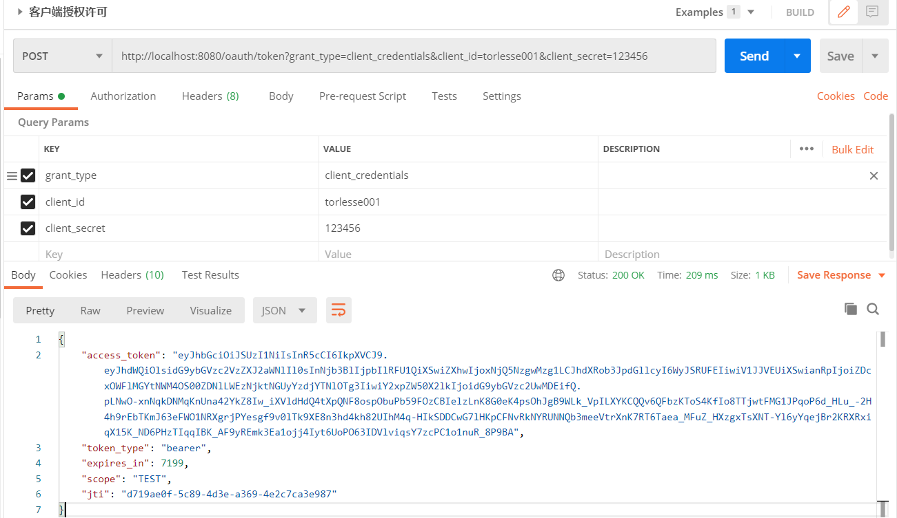

##### 3、资源拥有者凭据机制（密码模式）

使用postman发送请求

```
http://localhost:8080/oauth/token?grant_type=password&client_id=torlesse000&client_secret=123456&username=torlesse&password=123456
```

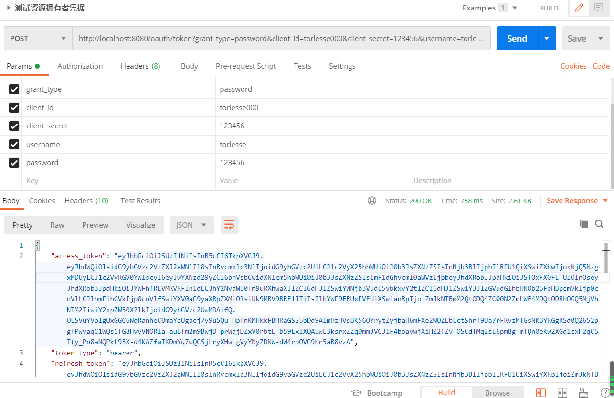

##### 4、授权码许可机制

打开浏览器访问

```
http://localhost:8080/oauth/authorize?response_type=code&client_id=torlesse002&redirect_uri=https://baidu.com
```

点击登陆，并授权

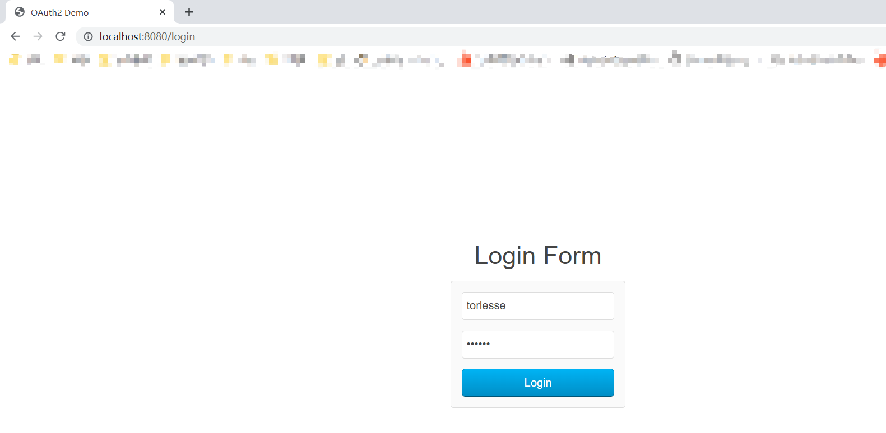

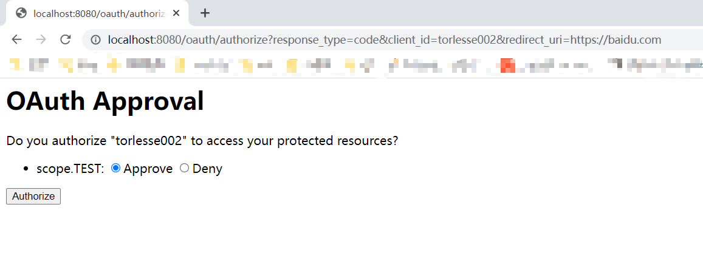

获取授权码

```
https://www.baidu.com/?code=SBkZt5
```

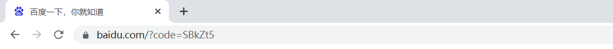


使用postman测试发送请求获取access_token

```
http://localhost:8080/oauth/token?grant_type=authorization_code&client_id=torlesse002&client_secret=123456&code=SBkZt5&redirect_uri=https://baidu.com
```

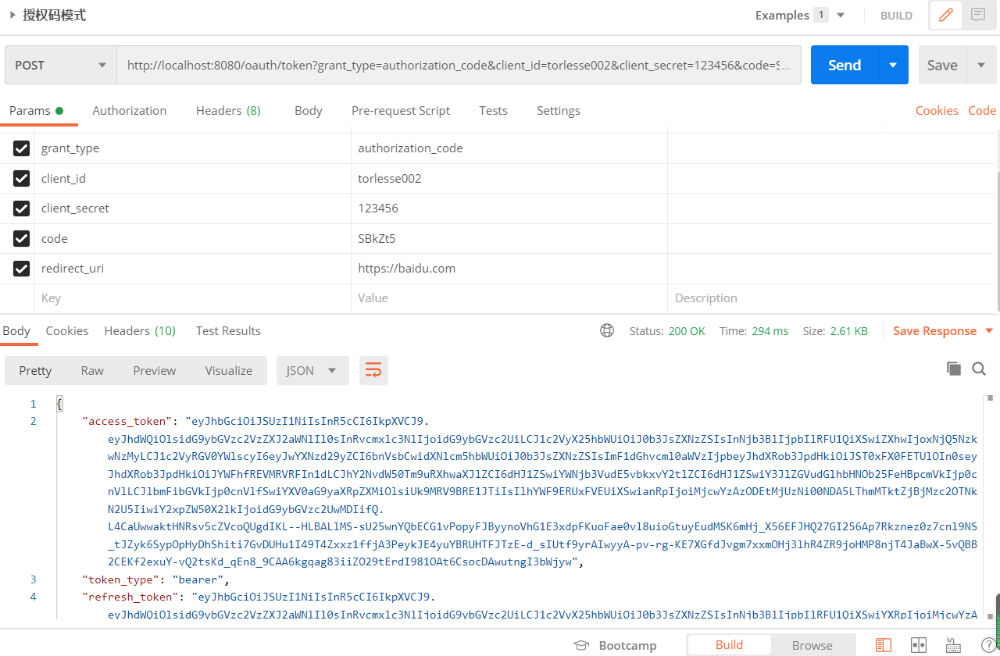

### 2.2、搭建客户端

#### 2.2.1 OAuth2Client客户端配置

OAuthClientConfig客户端配置

```
@Configuration
@EnableOAuth2Sso
public class OAuthClientConfig {
    /**
     * 定义OAuth2RestTemplate
     * 可从配置文件application.yml读取oauth配置注入OAuth2ProtectedResourceDetails
     * @param oAuth2ClientContext
     * @param details
     * @return
     */
    @Bean
    public OAuth2RestTemplate oauth2RestTemplate(OAuth2ClientContext oAuth2ClientContext,
                                                 OAuth2ProtectedResourceDetails details) {
        return new OAuth2RestTemplate(details, oAuth2ClientContext);
    }
}
```

#### 2.2.2 spring security配置

```
@Configuration
@Order(200)
public class WebSecurityConfig extends WebSecurityConfigurerAdapter {
    /**
     * /路径和/login路径允许访问，其它路径需要身份认证后才能访问
     *
     * @param http
     * @throws Exception
     */
    @Override
    protected void configure(HttpSecurity http) throws Exception {
        http
                .authorizeRequests()
                .antMatchers( "/demo**","/login**")
                .permitAll()
                .antMatchers("/test/hello")
                .anonymous()
                .anyRequest()
                .authenticated();
    }
}
```

#### 2.2.3 场景模拟DemoController

```
@RestController
@RequestMapping("/demo")
public class DemoController {
    @Autowired
    OAuth2RestTemplate restTemplate;

    /**
     * 用于单点登录测试
     * @param authentication
     * @return
     */
    @GetMapping("/userInfoPage")
    public ModelAndView securedPage(OAuth2Authentication authentication) {
        return new ModelAndView("userInfoPage").addObject("authentication", authentication);
    }

    /**
     * 访问受保护资源
     * @return
     */
    @GetMapping("/remoteCall")
    public String remoteCall() {
        ResponseEntity<String> responseEntity = restTemplate.getForEntity("http://localhost:8081/user/name", String.class);
        return responseEntity.getBody();
    }
}
```


### 2.3、搭建资源服务器

#### 2.3.1 资源服务器配置

```
@Configuration
@EnableResourceServer//启动资源服务器
@EnableGlobalMethodSecurity(prePostEnabled = true)//启动注解的方式进行权限控制
public class ResourceServerConfiguration extends ResourceServerConfigurerAdapter {

    /**
     * 声明了资源服务器的ID是torlesseservice，声明了资源服务器的TokenStore是JWT
     * @param resources
     * @throws Exception
     */
    @Override
    public void configure(ResourceServerSecurityConfigurer resources) throws Exception {
       resources.resourceId("torlesseservice").tokenStore(tokenStore());
    }

    @Bean
    public TokenStore tokenStore(){
        return new JwtTokenStore(jwtAccessTokenConverter());
    }

    /**
     * 配置公钥
     * @return
     */
    @Bean
    protected JwtAccessTokenConverter jwtAccessTokenConverter() {
        JwtAccessTokenConverter converter = new JwtAccessTokenConverter();
        Resource resource = new ClassPathResource("public.cert");
        String publicKey = null;
        try {
            publicKey = new String(FileCopyUtils.copyToByteArray(resource.getInputStream()));
        } catch (IOException e) {
            e.printStackTrace();
        }
        converter.setVerifierKey(publicKey);
        return converter;
    }


    /**
     * 配置了除了/user路径之外的请求可以匿名访问
     * @param http
     * @throws Exception
     */
    @Override
    public void configure(HttpSecurity http) throws Exception {
        http.authorizeRequests()
                .antMatchers(HttpMethod.POST,"/user/**").authenticated()
                .antMatchers(HttpMethod.GET,"/user/**").authenticated()
                .anyRequest().permitAll();
    }
}
```

#### 2.3.2 受保护资源UserController

```
@RestController
@RequestMapping("/user")
public class UserController {

    @Autowired
    private TokenStore tokenStore;

    /***
     * 管理员可访问，返回登录用户名
     * @param authentication
     * @return
     */
    @PreAuthorize("hasRole('ROLE_ADMIN')")
    @GetMapping("/name")
    public String name(OAuth2Authentication authentication) {
        return authentication.getName();
    }

    /**
     * 超级管理员可访问，返回登录用户信息
     *
     * @param authentication
     * @return
     */
    @PreAuthorize("hasRole('ROLE_SUPER_ADMIN')")
    @GetMapping
    public OAuth2Authentication testRoleSuperAdmin(OAuth2Authentication authentication) {
        return authentication;
    }

    /**
     * 只有ROLE_ADMIN权限可以访问，返回访问令牌中的额外信息
     * @param authentication
     * @return
     */
    @PreAuthorize("hasRole('ROLE_ADMIN')")
    @PostMapping
    public Object testRoleAdmin(OAuth2Authentication authentication) {
        OAuth2AuthenticationDetails details = (OAuth2AuthenticationDetails) authentication.getDetails();
        OAuth2AccessToken accessToken = tokenStore.readAccessToken(details.getTokenValue());
        return accessToken.getAdditionalInformation().getOrDefault("userDetails", null);
    }
}
```


### 2.4、 模拟测试

#### 2.4.1 postman模拟客户端访问受保护资源

使用torlesse用户拿到token，然后使用postman模拟客户端访问受保护资源

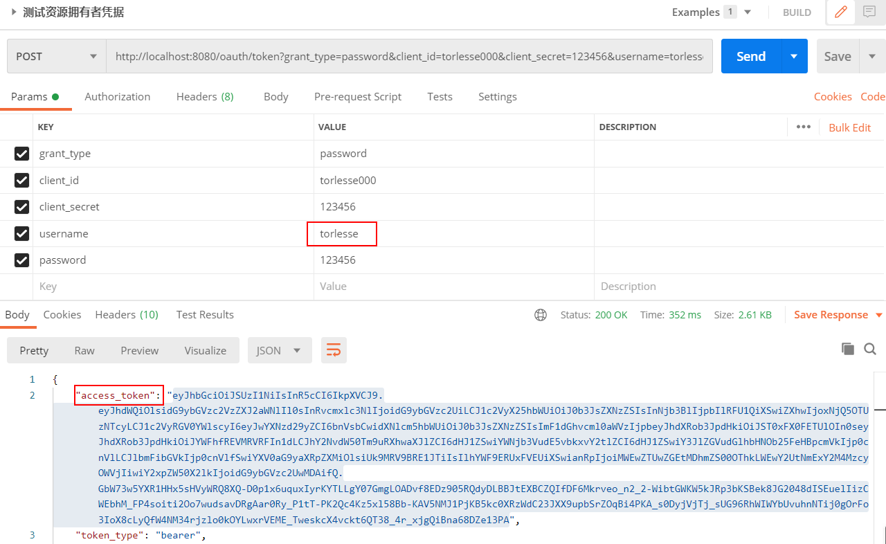

postman作为模拟客户端，模拟访问受保护资源

```
http://localhost:8081/user/name
```

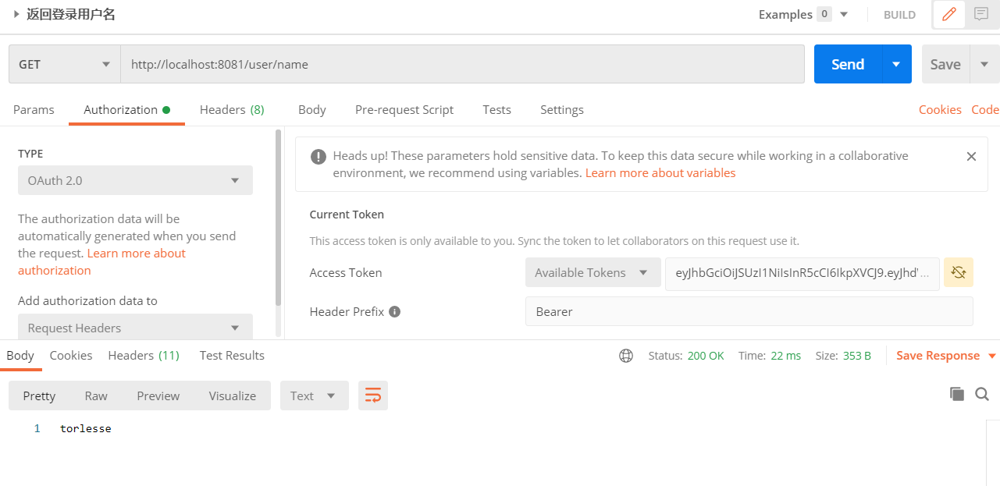

#### 2.4.2客户端访问受保护资源

浏览器访问：http://localhost:8083/torlesse/demo/remoteCall

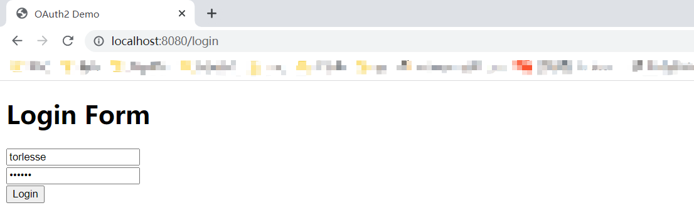

点击登录

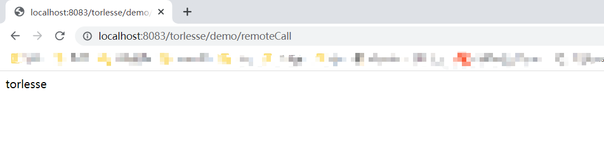

访问到受保护资源演示成功。


#### 2.4.3演示单点登录

##### 准备工作

1）启动两个客户端 端口分别问8082 8083

1.1、修改客户端配置文件application.yml

```
server:
  port: ${PORT:8083}
```

1.2、配置多个客户端

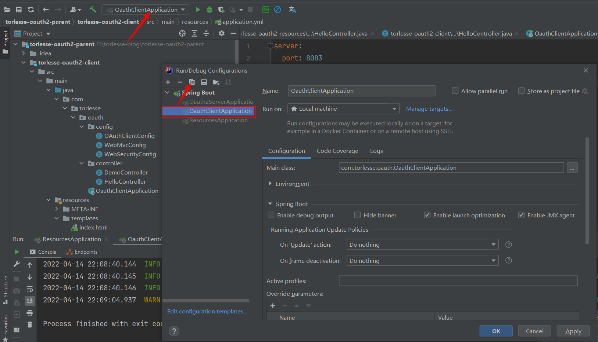

VM options设置：-DPORT=8082

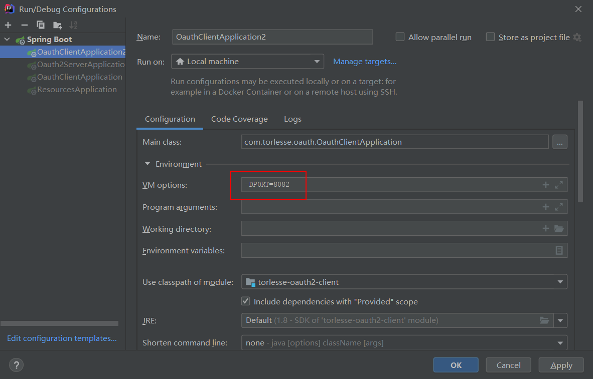

启动

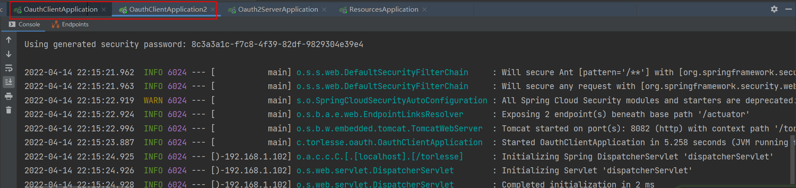


##### 单点登录验证

浏览器访问：http://localhost:8083/torlesse/demo/userInfoPage

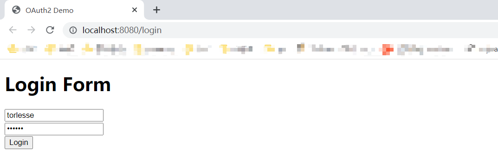

点击登录

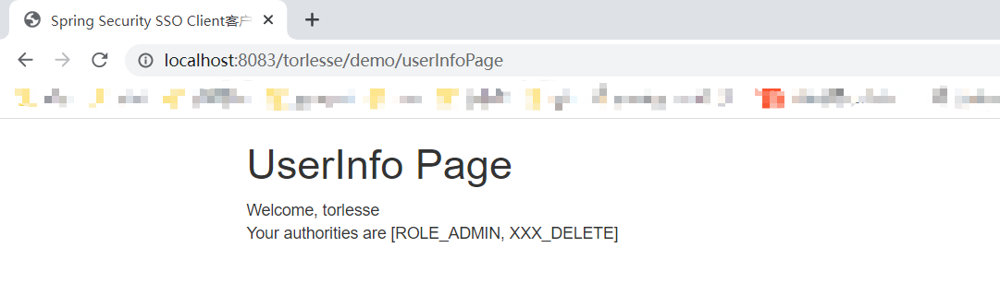


浏览器访问：http://localhost:8082/torlesse/demo/userInfoPage

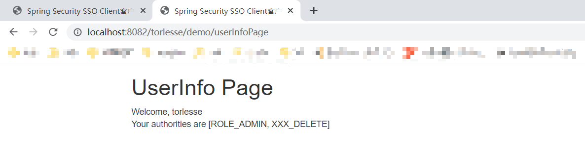

单点登录演示成功。


### 2.5、自定义授权模式

Oauth2.0具有多种授权许可机制协议：授权码许可机制、客户端凭据机制、资源拥有者凭据机制（密码模式）和隐式许可机制。

在源码中即可看到四种模式的实现类，还有一个RefreshTokenGranter则是刷新令牌，用于access_token失效时刷新过期时间。


假如现在我需要实现手机验证码登录或者微信扫码登录等功能的时候，我们该如何处理呢？

我们可以继承AbstractTokenGranter实现自定义授权模式。


**手机短信验证码模式**如下：

#### 2.5.1 继承AbstractTokenGranter类， 实现手机验证码自定义模式

```
@Slf4j
public class SmsCodeGranter extends AbstractTokenGranter {

    private static final String GRANT_TYPE = "sms_code";

    protected final AuthenticationManager authenticationManager;

    protected final UserMapper userMapper;

    public SmsCodeGranter(AuthenticationManager authenticationManager, AuthorizationServerTokenServices tokenServices,
                          ClientDetailsService clientDetailsService, OAuth2RequestFactory requestFactory, UserMapper userMapper) {
        super(tokenServices, clientDetailsService, requestFactory, GRANT_TYPE);
        this.authenticationManager = authenticationManager;
        this.userMapper = userMapper;
    }

    @Override
    protected OAuth2Authentication getOAuth2Authentication(ClientDetails client, TokenRequest tokenRequest) {

        Map<String, String> parameters = new LinkedHashMap(tokenRequest.getRequestParameters());
        String telephone = parameters.get("telePhone");
        String code = parameters.get("code");

        if (StringUtils.isEmpty(telephone) || StringUtils.isEmpty(code)) {
            throw new InvalidGrantException("参数错误.");
        }
        CheckParam checkParam = new CheckParam();
        checkParam.setTelePhone(telephone);
        User user = userMapper.selectUserByCondition(checkParam.getTelePhone());

        log.info("telephone = {}, code = {}, user = {}", telephone, code, JSON.toJSONString(user));
        // 根据手机号码查询用户信息
        if (user == null) {
            throw new InvalidGrantException("手机号码填写错误.");
        }

        Authentication userAuth = new TelePhoneAuthenticationToken(user.getUsername(), user.getPassword(), telephone, code);
        ((AbstractAuthenticationToken) userAuth).setDetails(parameters);

        try {
            userAuth = this.authenticationManager.authenticate(userAuth);
        } catch (AccountStatusException var8) {
            throw new InvalidGrantException("当前用户已经被锁定,请联系客服.");
        } catch (BadCredentialsException var9) {
            throw new InvalidGrantException("用户信息查询异常,请确认是否注册.");
        } catch (InternalAuthenticationServiceException var10) {
            throw new InvalidGrantException("验证码校验失败.");
        }

        if (userAuth != null && userAuth.isAuthenticated()) {
            OAuth2Request storedOAuth2Request = this.getRequestFactory().createOAuth2Request(client, tokenRequest);
            return new OAuth2Authentication(storedOAuth2Request, userAuth);
        } else {
            throw new InvalidGrantException("Could not authenticate user: " + telephone);
        }

    }
}
```

手机验证码token

```
public class TelePhoneAuthenticationToken extends UsernamePasswordAuthenticationToken {

    private String telePhone;

    private String code;

    /**
     * @param principal 用户名
     */
    public TelePhoneAuthenticationToken(Object principal, Object credentials, String telePhone, String code) {
        super(principal, credentials);
        setAuthenticated(false);
        this.telePhone = telePhone;
        this.code = code;
    }

    public String getTelePhone() {
        return telePhone;
    }

    public String getCode() {
        return code;
    }
}
```

#### 2.5.2 授权服务器配置修改

AuthorizationServerConfig授权服务器配置类中添加TokenGranter

```
 /**
     * 初始化所有的TokenGranter
     */
    private List<TokenGranter> getDefaultTokenGranters(AuthorizationServerEndpointsConfigurer endpoints) {

        ClientDetailsService clientDetails = endpoints.getClientDetailsService();
        AuthorizationServerTokenServices tokenServices = endpoints.getTokenServices();
        AuthorizationCodeServices authorizationCodeServices = endpoints.getAuthorizationCodeServices();
        OAuth2RequestFactory requestFactory = endpoints.getOAuth2RequestFactory();

        List<TokenGranter> tokenGranters = new ArrayList<>();
        tokenGranters.add(new AuthorizationCodeTokenGranter(tokenServices, authorizationCodeServices, clientDetails,
                requestFactory));
        tokenGranters.add(new RefreshTokenGranter(tokenServices, clientDetails, requestFactory));
        ImplicitTokenGranter implicit = new ImplicitTokenGranter(tokenServices, clientDetails, requestFactory);
        tokenGranters.add(implicit);
        tokenGranters.add(new ClientCredentialsTokenGranter(tokenServices, clientDetails, requestFactory));
        if (authenticationManager != null) {
            tokenGranters.add(new ResourceOwnerPasswordTokenGranter(authenticationManager, tokenServices,
                    clientDetails, requestFactory));
            tokenGranters.add(new SmsCodeGranter(authenticationManager, endpoints.getTokenServices(),
                    endpoints.getClientDetailsService(), endpoints.getOAuth2RequestFactory(), userMapper));
        }
        return tokenGranters;
    }
```

修改AuthorizationServer配置令牌访问端点，添加以下内容

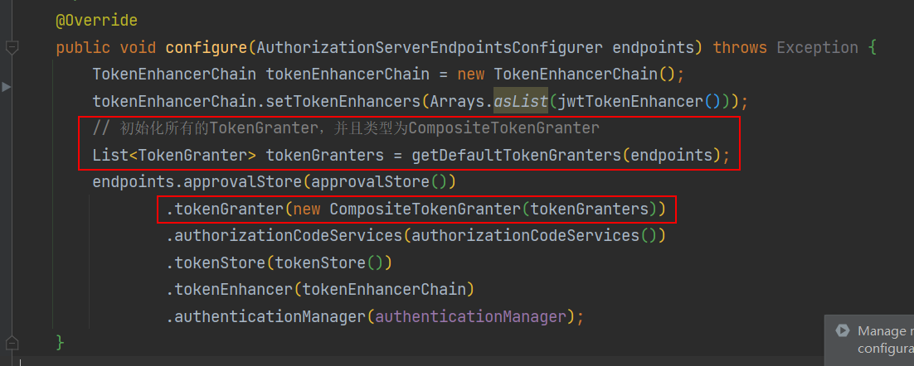

```
 @Override
    public void configure(AuthorizationServerEndpointsConfigurer endpoints) throws Exception {
        TokenEnhancerChain tokenEnhancerChain = new TokenEnhancerChain();
        tokenEnhancerChain.setTokenEnhancers(Arrays.asList(jwtTokenEnhancer()));
        // 初始化所有的TokenGranter，并且类型为CompositeTokenGranter
        List<TokenGranter> tokenGranters = getDefaultTokenGranters(endpoints);
        endpoints.approvalStore(approvalStore())
                .tokenGranter(new CompositeTokenGranter(tokenGranters))
                .authorizationCodeServices(authorizationCodeServices())
                .tokenStore(tokenStore())
                .tokenEnhancer(tokenEnhancerChain)
                .authenticationManager(authenticationManager);
    }
```

#### 2.5.3 手机号验证码授权模式验证演示

postman模拟客户端发送请求

```
http://localhost:8080/oauth/token?grant_type=sms_code&client_id=torlesse004&client_secret=123456&telePhone=12345678999&code=123123
```

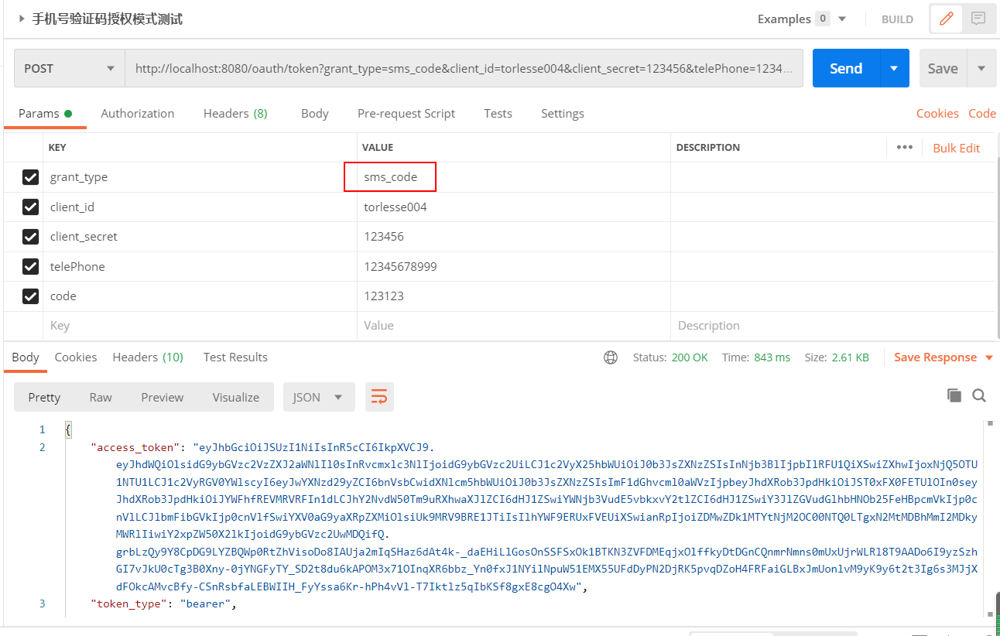

